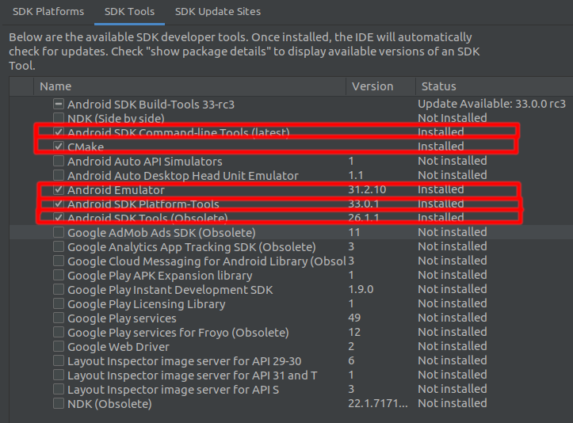

# Necessário instalar o appium pelo npm -g
npm -g appium

### Para verificar a instalação é interessante usar o appim-doctor
npm -g appium-doctor
appium-doctor

ou
npx appium-doctor

### Via sdk manager instalar os pacotes
- Android SDK Tools (Obsolete)
- SDK Command-line Tools
- Android Emulator
- Seu build tools atual

### Para verificar as telas do apk é necessário utilizar o uiautomatorviewer que está dentro da pasta /tools/bin do sdk do android
Esse aplicativo é usado para pegar os ids dos componentes da tela
